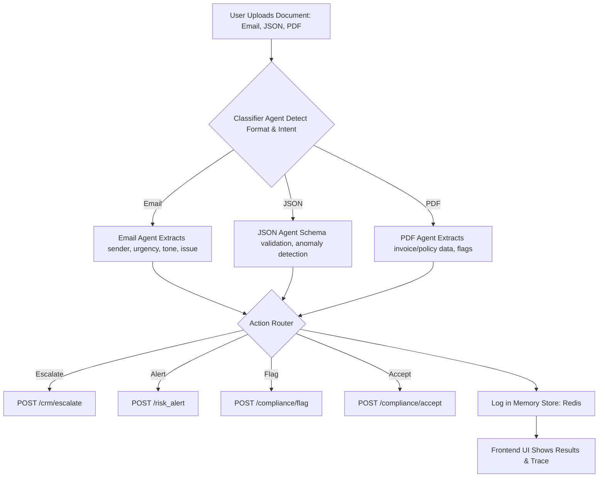
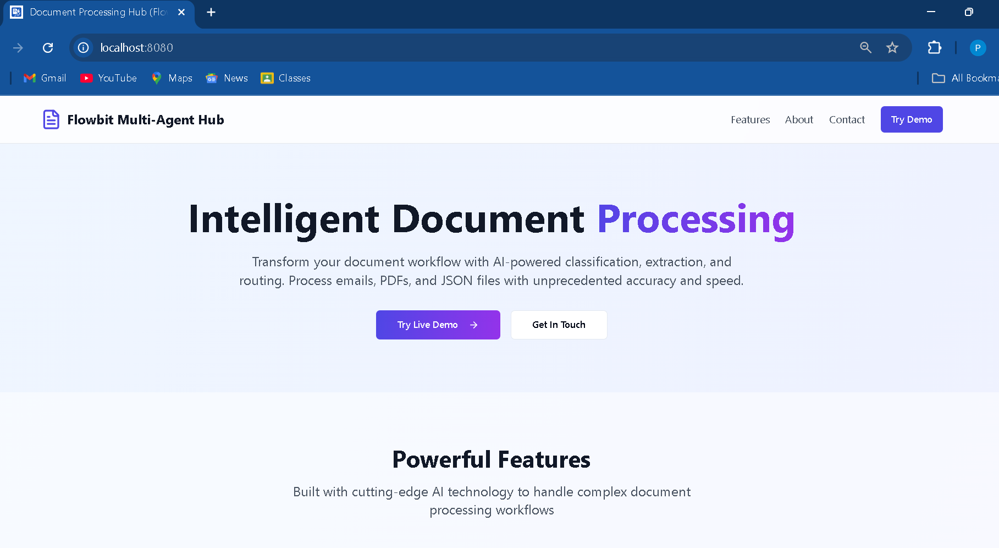
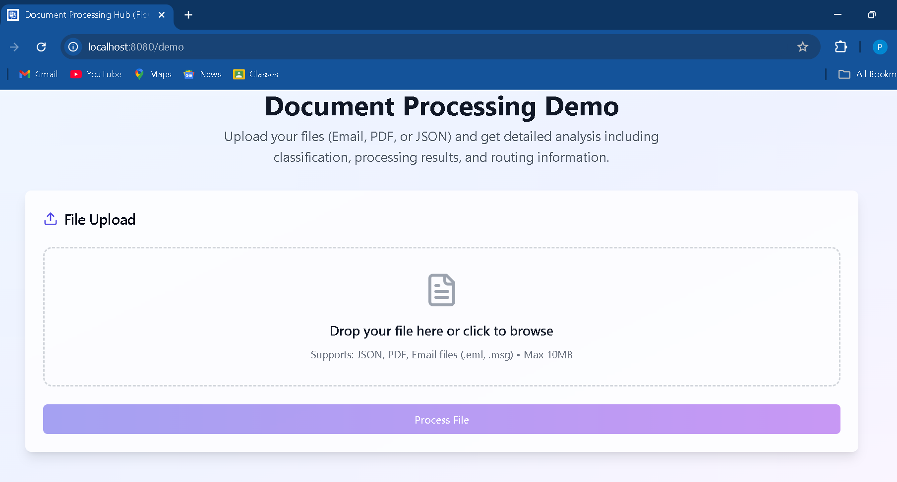
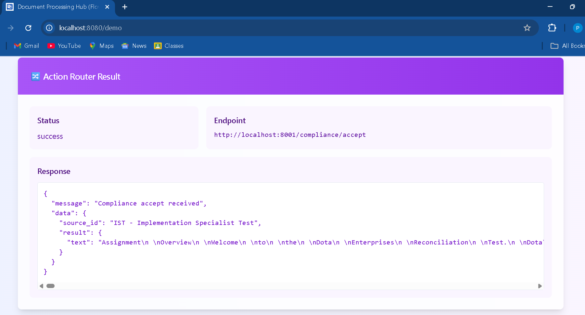

# Flowbit Multi-Agent Document Processing System

## Overview

Flowbit is an AI-powered, multi-format document processing system that classifies, extracts, and routes business documents such as Emails, JSON files, and PDFs. It features a modular multi-agent architecture, LLM-enhanced intelligence, automated action routing, and full auditability.

## Features

- Multi-format document classification (Email, JSON, PDF)
- Business intent detection (RFQ, Complaint, Invoice, Regulation, Fraud Risk)
- Specialized agents for Email, JSON, and PDF
- Automated action routing with retry logic
- Shared memory store for audit and traceability
- Modern React-based frontend for file upload and result display
- Dockerized backend and frontend for deployment

## Tech Stack

- **Backend:** Python, FastAPI, LangChain, Redis , Google Gemini API
- **Frontend:** React, Vite (custom UI)
- **Containerization:** Docker

## Gemini API Integration

This project uses the [Google Gemini API](https://ai.google.dev/gemini-api/docs) to power large language model (LLM) capabilities for document classification and intent detection. The backend integrates Gemini via the official Python SDK, using the `gemini-2.0-flash` model for fast, accurate results.

**How it's used:**
- The Classifier Agent sends document content to Gemini using a prompt with few-shot examples.
- Gemini returns the predicted intent or label, which is then used to route the document to the appropriate specialized agent.
- This enables robust, context-aware classification for Emails, JSON, and PDF documents.

**Example Gemini API usage in Python:**
from google import genai

client = genai.Client(api_key="YOUR_API_KEY")
response = client.models.generate_content(
model="gemini-2.0-flash",
contents="Classify this document: ...",
)
print(response.text)

For more, see the [Gemini API docs](https://ai.google.dev/gemini-api/docs).

## Project Structure
multi-agent-system/
├── agents/
├── core/
├── frontend/
│ ├── public/
│ ├── src/
│ ├── package.json
├── main.py
├── requirements.txt
├── .env
└── README.md

## Frontend

The frontend is a React application that provides a clean, modern UI for uploading documents and displaying detailed processing results, including classification, urgency, tone, and action routing outcomes.

- Tab title and favicon are customized for project branding.
- Displays all results returned by the backend: classification, processing results, agent processing, action router responses, and full trace logs.

### Running the Frontend

1. Navigate to the `frontend/` directory.
2. Install dependencies: `npm install`
3. Start the development server: `npm run dev`
4. Access the UI at [http://localhost:5173/demo](http://localhost:5173/demo)

## Backend

The backend is a FastAPI server that runs the multi-agent pipeline.

### Running the Backend

1. Create and activate a Python virtual environment.
2. Install dependencies: `pip install -r requirements.txt`
3. Set environment variables in `.env`.
4. Start the backend: `uvicorn main:app --reload`

## Usage

- Upload documents via the frontend.
- The backend processes each document through classification, agent extraction, and action routing.
- Results are displayed in the frontend UI.

## Dockerization

The project supports Docker for simplified deployment of both backend and frontend.

## Architecture Diagram

## Architecture Diagram

> **Note:** The Classifier Agent leverages the Gemini API (LLM) for advanced document classification and intent detection.

## How It Works!

1. **Document Upload:**  
   The user uploads a file (Email, JSON, or PDF) via the frontend UI.

2. **Classifier Agent:**  
   - Detects the document’s format and business intent using a combination of schema matching, Gemini LLM prompting, and fallback rules.
   - Sends a prompt with few-shot examples to the Gemini API for robust intent detection.
   - Passes routing metadata to the memory store and determines which specialized agent should process the file.

3. **Specialized Agents:**
   - **Email Agent:**  
     Extracts sender, subject, urgency, tone, and issue/request from emails. Determines if escalation or routine action is needed.
   - **JSON Agent:**  
     Validates the structure of incoming JSON files, distinguishes between Invoice and RFQ schemas, and flags anomalies (e.g., missing fields, type errors).
   - **PDF Agent:**  
     Extracts text and line-item data from PDFs, flags invoices over a threshold, and detects compliance mentions (e.g., “GDPR”, “FDA”).

4. **Action Router:**  
   - Based on the agent output, triggers follow-up actions such as escalating to CRM, flagging compliance, or logging an alert, via simulated REST API calls.
   - Includes retry logic for reliability.

5. **Memory Store & File Logging:**  
   - All agent decisions, extracted fields, and actions are logged in Redis for traceability.
   - Additionally, a file-based log (`logs/processing.log`) records all processing events and errors for audit and debugging.
   - All agent decisions and actions are logged both in Redis (for fast retrieval and chaining) and in a persistent log file at logs/processing.log for audit, debugging, and compliance purposes.

6. **Frontend Display:**  
   - The frontend fetches and displays all results, including classification, agent outputs, action router status, and full trace logs, in a recruiter-friendly UI.

## Sample Screenshots

## License

MIT

## Author

Pratik Dash
